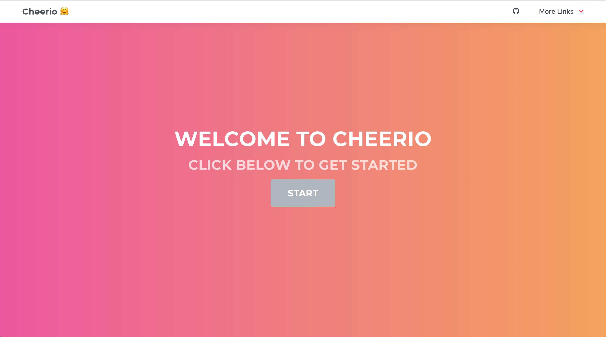
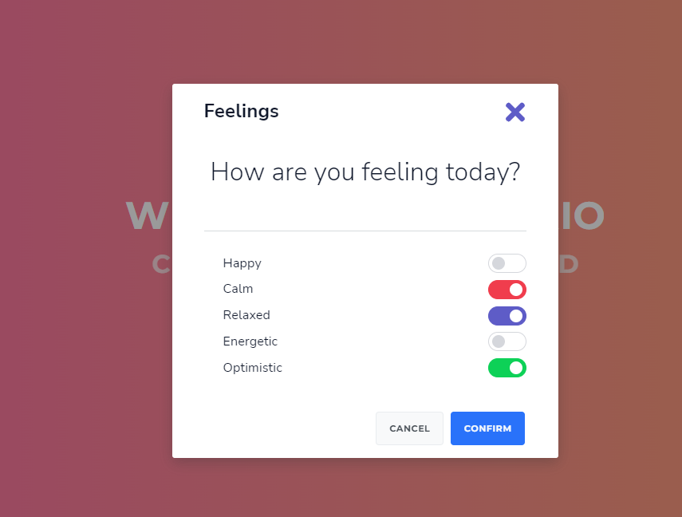
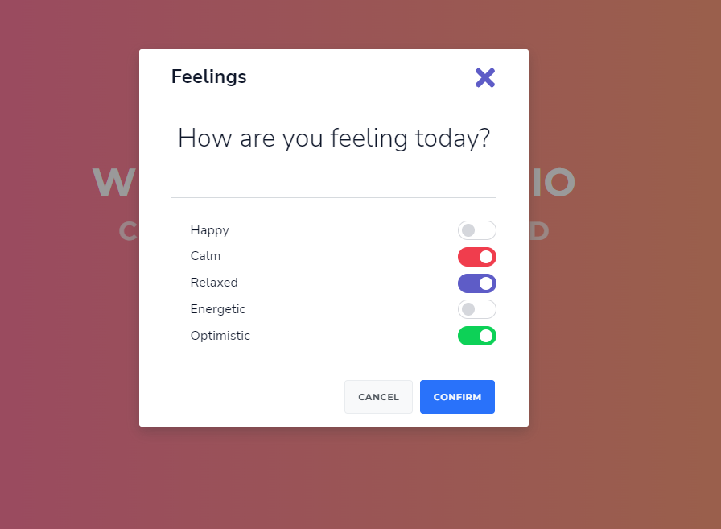

# **Cheerio**

## Description

* Cheerio is a web application that allows users to feel both motivated and inspired through inspirational quotes and visuals. Our web application best captivates users who are looking for words that will represent how they are feeling at that current moment. Cheerio allows users to input how they are currently feeling whether that be calm, optimistic, relaxed, etc and formulates randomized quotes and backgrounds that better captures and materializes into words what a user might be feeling at that time.

Click the link below to visit our live site: 

[ Cheerio 🤗](https://daevidvo.github.io/Cheerio/)

## Code Learning Points

* 

```html 

```
* 

```css

```
 
* 

```JavaScript

```


## **Technology Used**

| Technology Used         | Resource URL           | 
| ------------- |:-------------:| 
| HTML    | [https://developer.mozilla.org/en-US/docs/Web/HTML](https://developer.mozilla.org/en-US/docs/Web/HTML)|  
| CSS     | [https://developer.mozilla.org/en-US/docs/Web/CSS](https://developer.mozilla.org/en-US/docs/Web/CSS)      |   
| Git | [https://git-scm.com/](https://git-scm.com/)     |    
| Js  | [https://developer.mozilla.org/en-US/docs/Web/JavaScript](https://developer.mozilla.org/en-US/docs/Web/JavaScript)     |  
|Font Awesome|[(https://fontawesome.com/](https://fontawesome.com/)|
|Google Fonts|[https://fonts.google.com/](https://fonts.google.com/)|
|Cirrus|[https://cirrus-ui.netlify.app/getting-started/setup](https://cirrus-ui.netlify.app/getting-started/setup)|
||[]()|


## **Usage**

Click the link below to visit our live site: 

[ Cheerio 🤗](https://daevidvo.github.io/Cheerio/)

Here you can see the home page of Cheerio:
[]()

Here you can see a screenshot of what a user might select when inputting moods:
[]()

Here you can see a screenshot of the output a user might see after confirming their mood:
[]()

After refreshing the site user inputs are saved as seen below:
[]()

Here you can see our about us page:
[]()


## **Authors**

 ### David Vo

- [Link to Github](https://github.com/daevidvo)
- [Link to LinkedIn](https://www.linkedin.com/in/daevidvo/)

 ### Bryan Nguyen

- [Link to Github](https://github.com/bryannguyen9)
- [Link to LinkedIn](https://www.linkedin.com/in/bryannguyen9/)

 ### Kenneth
- [Link to Github](https://github.com/cruzkenneth504)
- [Link to LinkedIn](linkedin.com/in/cruzkenneth504)


## **Acknowledgments**

* [Cirrus Documentation](https://cirrus-ui.netlify.app/docs)
* [Java Script Documentation](https://devdocs.io/javascript/)
* [Documentation]()


## **License**

MIT License

Copyright (c) [2023] [Bryan-Nguyen]

Permission is hereby granted, free of charge, to any person obtaining a copy
of this software and associated documentation files (the "Software"), to deal
in the Software without restriction, including without limitation the rights
to use, copy, modify, merge, publish, distribute, sublicense, and/or sell
copies of the Software, and to permit persons to whom the Software is
furnished to do so, subject to the following conditions:

The above copyright notice and this permission notice shall be included in all
copies or substantial portions of the Software.

THE SOFTWARE IS PROVIDED "AS IS", WITHOUT WARRANTY OF ANY KIND, EXPRESS OR
IMPLIED, INCLUDING BUT NOT LIMITED TO THE WARRANTIES OF MERCHANTABILITY,
FITNESS FOR A PARTICULAR PURPOSE AND NONINFRINGEMENT. IN NO EVENT SHALL THE
AUTHORS OR COPYRIGHT HOLDERS BE LIABLE FOR ANY CLAIM, DAMAGES OR OTHER
LIABILITY, WHETHER IN AN ACTION OF CONTRACT, TORT OR OTHERWISE, ARISING FROM,
OUT OF OR IN CONNECTION WITH THE SOFTWARE OR THE USE OR OTHER DEALINGS IN THE
SOFTWARE.